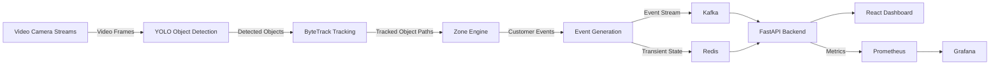
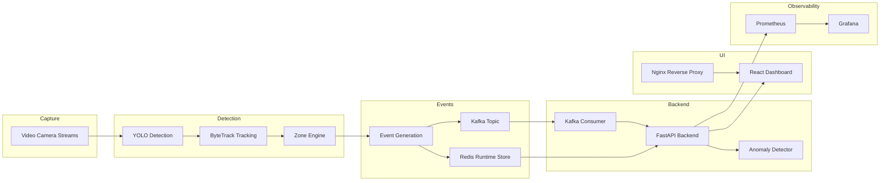
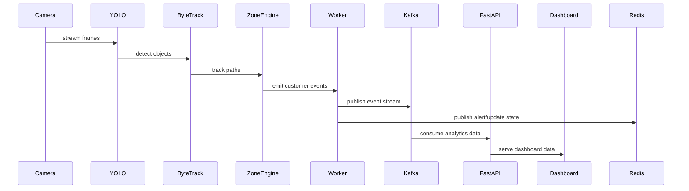
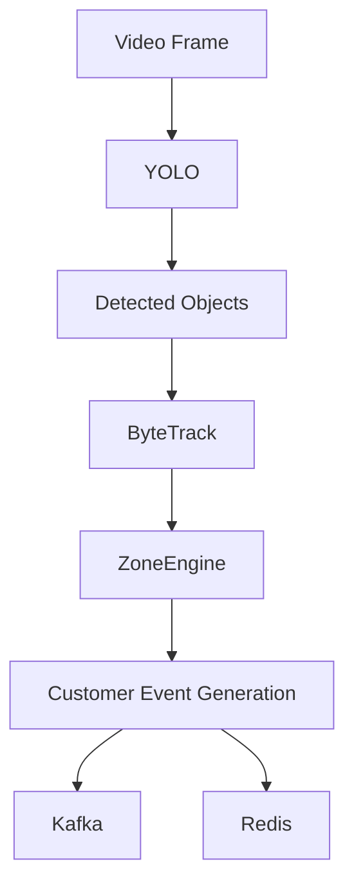
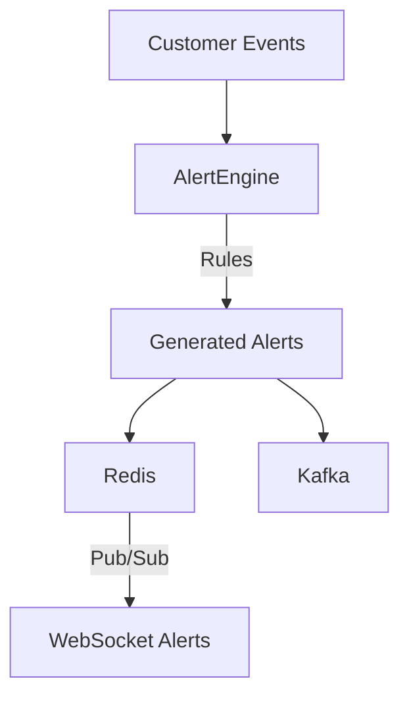
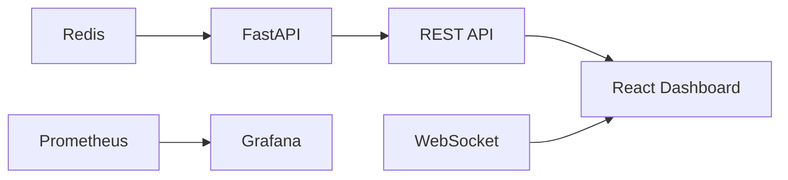
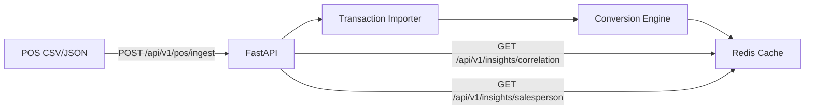
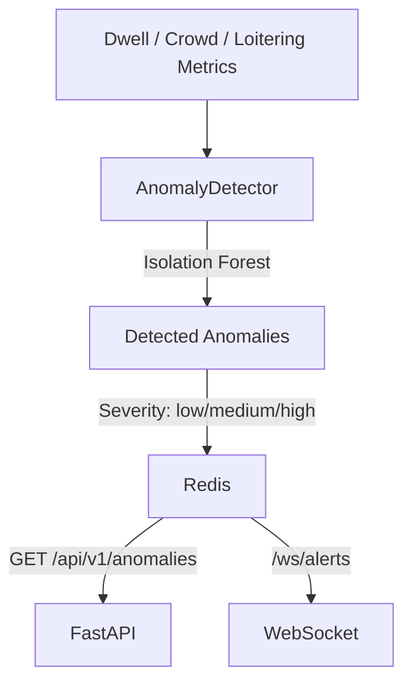

# Store Intelligence Platform Design

## Architecture Diagram



## Multi-Store / Multi-Camera Architecture

The system supports **2 stores with 4 cameras each** (8 concurrent video streams), enabling deployment across multiple retail locations.

- Each camera runs an **independent worker container**, allowing per-camera scaling and fault isolation.
- Store-level and camera-level metrics are aggregated in Redis for flexible querying.
- Camera configurations are defined in `config/cameras.json` with per-camera zone layouts in `config/store_*_camera_*_layout.json`.

```
Store 1                    Store 2
├── Camera 1 (worker)      ├── Camera 1 (worker)
├── Camera 2 (worker)      ├── Camera 2 (worker)
├── Camera 3 (worker)      ├── Camera 3 (worker)
└── Camera 4 (worker)      └── Camera 4 (worker)
         │                         │
         └──────────┬──────────────┘
                    ▼
               Kafka Topic
               (cv.detections)
```

## Component Responsibilities

### Core Services

- `worker.py`
  - Orchestrates the video ingestion and event pipeline.
  - Reads frames, applies YOLO detection, tracks objects with ByteTrack, and publishes enriched customer events.
  - Sends alert and conversion events to Kafka and Redis while preserving existing topic contracts.

- `zone_manager.py`
  - Loads dynamic polygon definitions for store zones.
  - Identifies active zones, zone transitions, and location-based event triggers.
  - Provides reusable geometry logic for customer journey detection.

- `video_processor.py`
  - Converts tracked object movement into customer event types.
  - Filters staff and noise, and labels events like `entry`, `exit`, `browse`, `checkout_visit`, and `dwell_time`.
  - Ensures events are emitted in a format compatible with downstream analytics.

- `conversion_engine.py`
  - Computes funnel stage transitions and converts customer path events into conversion metrics.
  - Tracks sessions, guards against double counting, and aggregates funnel stage counts.

- `alert_engine.py`
  - Applies business rules to detect anomalies and risk conditions.
  - Generates severity-tagged alerts for overcrowding, bottlenecks, spikes, and dwell issues.
  - Publishes alerts in real time to the existing `/ws/alerts` channel.

- `event_store.py`
  - Provides event storage and retrieval for analytics queries.
  - Stores processed events in Redis for fast access by the API layer.
  - Supports filtering by store, camera, zone, and time range.

- `transaction_importer.py`
  - Ingests POS CSV transaction data via the `/api/v1/pos/ingest` endpoint.
  - Maps transactions into conversion events and integrates funnel data.
  - Computes daily aggregates and caches them in Redis.

### Detection & Analytics

- `anomaly_detector.py`
  - Implements **Isolation Forest** algorithm for unsupervised anomaly detection.
  - Analyzes dwell time, crowd count, and loitering metrics to detect unusual patterns.
  - Returns severity-tagged anomalies (`low`, `medium`, `high`) via the `/api/v1/anomalies` endpoint.

- `kafka_consumer.py`
  - Consumes detection events from Kafka topics (`cv.detections`).
  - Processes incoming events and updates Redis state for real-time analytics.
  - Runs as an async background task within the FastAPI application lifespan.

### Event Infrastructure

- `events/publisher.py`
  - Publishes events to Kafka topics and Redis pub/sub channels.
  - Provides a unified interface for event emission across all services.

- `events/schema.py`
  - Defines event schemas and data contracts for all event types.
  - Ensures consistency between producers (workers) and consumers (API).

### Staff Filtering & Re-entry Tracking

- **Staff Filtering**: Prevents employees from being counted in footfall analytics by filtering based on known staff patterns or identifiers.
- **Re-entry Tracking**: Identifies customers who leave and re-enter the store, preventing double-counting in occupancy and conversion metrics.
- Both features improve the accuracy of visitor counts and conversion rate calculations.

### Salesperson Tracking

- `seed_salesperson.py`
  - Seeds initial salesperson records into Redis for POS transaction attribution.
  - Enables the salesperson leaderboard (`/api/v1/insights/salesperson`) ranked by GMV.

## API Endpoints

| Method | Endpoint | Description |
|--------|----------|-------------|
| GET | `/health` | Health check of API and dependencies |
| GET | `/api/v1/stores` | List all configured stores |
| GET | `/api/v1/stores/{store_id}/cameras` | List cameras for a store |
| GET | `/api/v1/store-metrics` | Store KPIs (entries, exits, occupancy, dwell time) |
| GET | `/api/v1/funnel` | Conversion funnel analytics |
| GET | `/api/v1/anomalies` | Recent anomalies with filtering |
| POST | `/api/v1/pos/ingest` | Ingest POS data (CSV or JSON) |
| GET | `/api/v1/insights/correlation` | Vision-to-POS correlation insights |
| GET | `/api/v1/insights/salesperson` | Salesperson leaderboard by GMV |
| WS | `/ws/alerts` | Real-time WebSocket stream of anomaly events |
| GET | `/metrics` | Prometheus metrics endpoint |

## Event Flow

- `entry`
  - Customer enters the store boundary and is recognized as arriving in the monitored area.

- `exit`
  - Customer leaves the monitored area after a visit or interaction.

- `browse`
  - Customer spends time in a defined browsing zone, indicating active consideration.

- `checkout_visit`
  - Customer moves into the checkout zone, signaling potential purchase intent.

- `dwell_time`
  - Customer remains in a zone beyond a configured threshold, used for engagement and anomaly detection.

- `conversion`
  - POS transaction ingestion maps completed purchases to conversion events for funnel analytics.

## Monitoring Flow

- `Prometheus`
  - Scrapes FastAPI and worker metrics.
  - Captures custom counters for alerts, conversions, zone transitions, and occupancy breaches.

- `Grafana`
  - Visualizes live metrics and store performance.
  - Uses preconfigured dashboards for alert trends, funnel performance, and camera throughput.

- `Custom Metrics`
  - `alerts_generated_total`
  - `zone_transitions_total`
  - `conversion_events_total`
  - `occupancy_threshold_breaches_total`

## Scaling Considerations

- Stateless pipeline design enables horizontal scaling of workers and API replicas.
- Kafka decouples producers and consumers, allowing independent scaling of ingest, analytics, and dashboard layers.
- Redis supports low-latency runtime state and realtime pub/sub without changing existing key semantics.
- Prometheus and Grafana remain horizontally scalable through federated collection and read replicas.
- Additional cameras and stores can be handled by more worker instances and zone configurations rather than monolithic rework.

## Architecture Diagrams

### System Architecture



### Sequence Diagram



### Video Processing Flow



### Alert Processing Flow



### Dashboard Data Flow



### POS Data Ingestion Flow



### Anomaly Detection Flow


