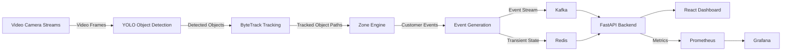
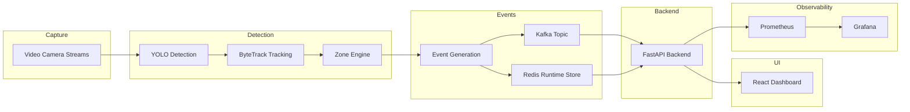
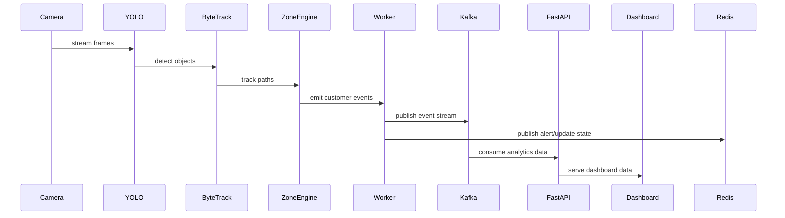
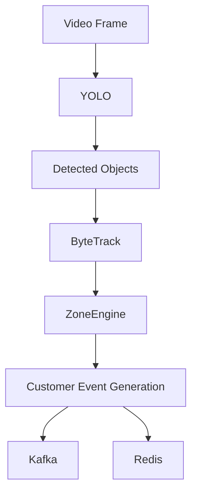
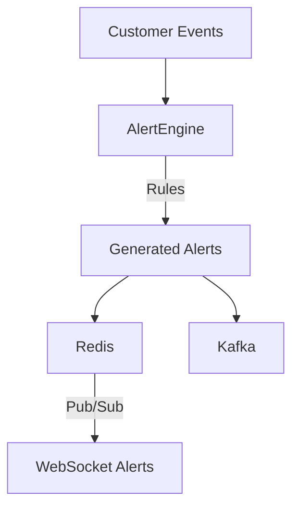
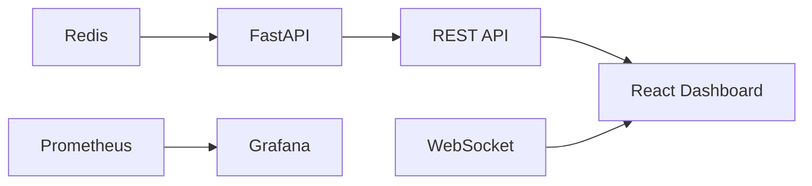

# Store Intelligence Platform Design

## Architecture Diagram

## Component Responsibilities

- `worker.py`
  - Orchestrates the video ingestion and event pipeline.
  - Reads frames, applies YOLO detection, tracks objects with ByteTrack, and publishes enriched customer events.
  - Sends alert and conversion events to Kafka and Redis while preserving existing topic contracts.

- `zone_manager.py`
  - Loads dynamic polygon definitions for store zones.
  - Identifies active zones, zone transitions, and location-based event triggers.
  - Provides reusable geometry logic for customer journey detection.

- `video_processor.py`
  - Converts tracked object movement into customer event types.
  - Filters staff and noise, and labels events like `entry`, `exit`, `browse`, `checkout_visit`, and `dwell_time`.
  - Ensures events are emitted in a format compatible with downstream analytics.

- `conversion_engine.py`
  - Computes funnel stage transitions and converts customer path events into conversion metrics.
  - Tracks sessions, guards against double counting, and aggregates funnel stage counts.

- `alert_engine.py`
  - Applies business rules to detect anomalies and risk conditions.
  - Generates severity-tagged alerts for overcrowding, bottlenecks, spikes, and dwell issues.
  - Publishes alerts in real time to the existing `/ws/alerts` channel.

- `transaction_importer.py`
  - Ingests POS CSV transaction data.
  - Maps transactions into conversion events and integrates funnel data without altering endpoint behavior.

## Event Flow

- `entry`
  - Customer enters the store boundary and is recognized as arriving in the monitored area.

- `exit`
  - Customer leaves the monitored area after a visit or interaction.

- `browse`
  - Customer spends time in a defined browsing zone, indicating active consideration.

- `checkout_visit`
  - Customer moves into the checkout zone, signaling potential purchase intent.

- `dwell_time`
  - Customer remains in a zone beyond a configured threshold, used for engagement and anomaly detection.

- `conversion`
  - POS transaction ingestion maps completed purchases to conversion events for funnel analytics.

## Monitoring Flow

- `Prometheus`
  - Scrapes FastAPI and worker metrics.
  - Captures custom counters for alerts, conversions, zone transitions, and occupancy breaches.

- `Grafana`
  - Visualizes live metrics and store performance.
  - Uses preconfigured dashboards for alert trends, funnel performance, and camera throughput.

- `Custom Metrics`
  - `alerts_generated_total`
  - `zone_transitions_total`
  - `conversion_events_total`
  - `occupancy_threshold_breaches_total`

## Scaling Considerations

- Stateless pipeline design enables horizontal scaling of workers and API replicas.
- Kafka decouples producers and consumers, allowing independent scaling of ingest, analytics, and dashboard layers.
- Redis supports low-latency runtime state and realtime pub/sub without changing existing key semantics.
- Prometheus and Grafana remain horizontally scalable through federated collection and read replicas.
- Additional cameras and stores can be handled by more worker instances and zone configurations rather than monolithic rework.

## Architecture Diagrams

### System Architecture

### Sequence Diagram

### Video Processing Flow

### Alert Processing Flow

### Dashboard Data Flow

